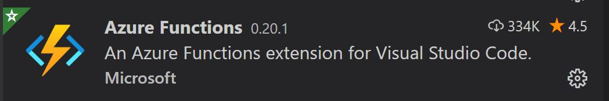

# Step 2: Install Functions Extension for VSCode

## What's this all about?
In this step you will install the Azure Functions extension for Visual Studio Code if you haven't already. You will also need the Azure Functions Core Tools. 

## TL;DR
- Install Azure Functions Extension if you haven't already.
- Install Azure Functions Core Tools if you haven't already.

## Known gotchas

1. If you are unable to install for some reason you won't be able to get very far with this tutorial.

2. You don't definitely need the Functions Core Tools but if you don't have them installed you won't be able to test locally.

## Azure Functions Extension

You can use [this web link](https://marketplace.visualstudio.com/items?itemName=ms-azuretools.vscode-azurefunctions) to access the Azure Functions extension on the marketplace and it install from there.  
You can also install this from within VS Code. Click the button that looks like this  on the side panel and search for "Azure Functions". You should find the extension that looks like this.

Click on this and click 'Install'.

## Azure Functions Core Tools

There are instructions [here](https://docs.microsoft.com/en-us/azure/azure-functions/functions-run-local) on how to install the Azure Functions Core Tools. Do this now.

When that is all installed you are ready to move on to [Step 3](STEP3.md)
