# Step 5: Build the Logic App

## What's this all about?

In this step we will create a Logic App. A Logic App is a low code / no code serverless solution that is similar to [Power Automate (Flow)](https://flow.microsoft.com/). This powerful automation tool can be used to quickly build the 'connective tissue' of Serverless solutions. We are using the Logic App to do the following things:

1. Create a recurrent schedule. Azure takes responsibility for running that schedule for you and keeps a log of success and failure.

2. Call the function we created in [Step 4](STEP4.md) to generate some content.

3. Post that generated content to Twitter for all the world to see.

## TL;DR

- Create the Logic App on a recurrent schedule that calls your function.
- Post the content to Twitter.
- See how it breaks based on Twitter's rules about duplicate content.

## Known gotchas

1. You will need to authorise access to Twitter so make sure you have the log in details handy if they are not already stored in your browser.

2. As noted in the [README](README.md) if you are planning on setting up a new Twitter account for this project that will require a new email address.

## Create the Logic App

Over in the Azure portal, go to your resource group (the one created in [Step 4](STEP4.md)) and click the '+ Add' button in the top bar of the Overview panel.

In the 'Search the Marketplace' bar at the top of the 'New' panel type `Logic App` and click the matching search result. You will then be presented with a page with this at the top.

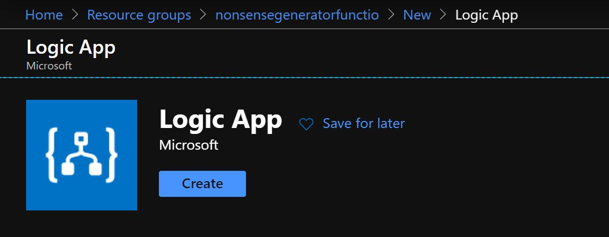

Click 'Create' and you will get presented with the creation form.

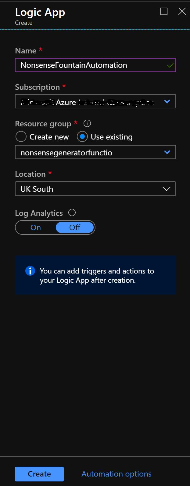

Give the Logic App a sensible name, make sure you are in the intended subscription, make sure to 'Use existing' Resource Group and select the one we created for this project. Choose the same region as you have been using all along and leave Log Analytics off for now.

Then click 'Create' at the bottom. This will send Azure off to create that for you. When it is done you should see the Logic App in your resource group.

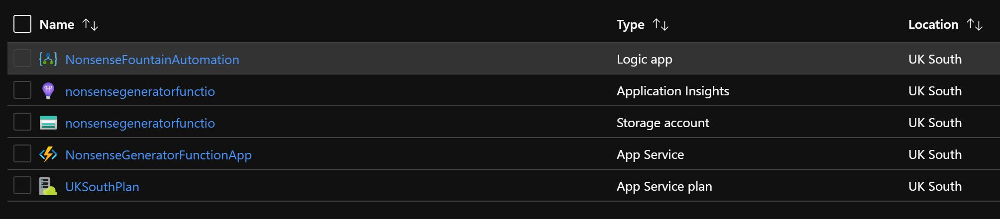

Click on that and you will get presented with the 'First view' Logic Apps Designer panel.

## Build the Logic App one block at a time

Click on 'Recurrence' in the 'Start with a common trigger' section.

## Recurrence

This will take you to the full Designer view. With the Recurrence node open.

In this example I have set it to trigger once every hour. It's really up to you how often you trigger but you should think about two things:

1. Your audience on Twitter. Is your bot going to be so interesting that people want to see it's tweet more than once an hour?

2. Cost. If you are calling your Logic App and Function on a consumption plan, how much are you going to spend calling it once every 30 seconds? Best to slow it down. We can always trigger the Logic App manually to test it.

## Integrate and call your Function

Click the '+ New step' button and search for an HTTP step.

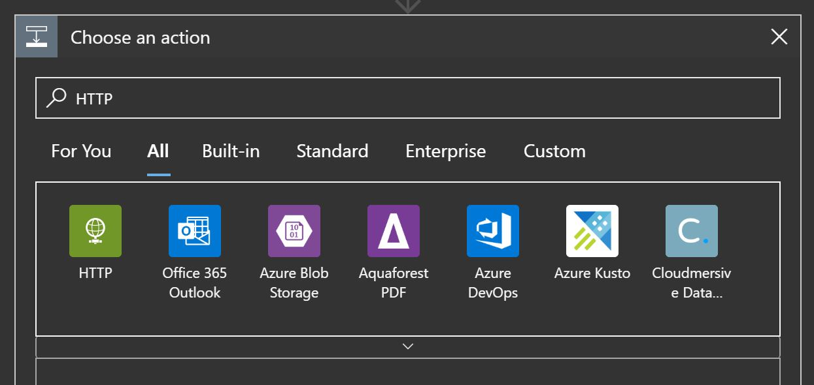

Click the green HTTP step and choose 'HTTP/HTTP' in Actions.

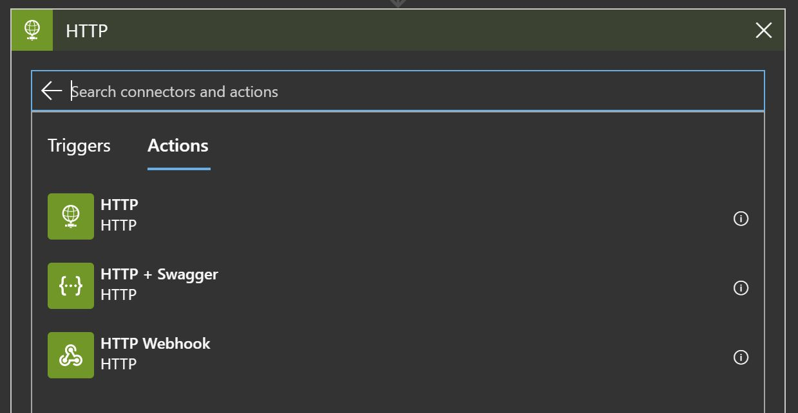

We now need to fill in the details.

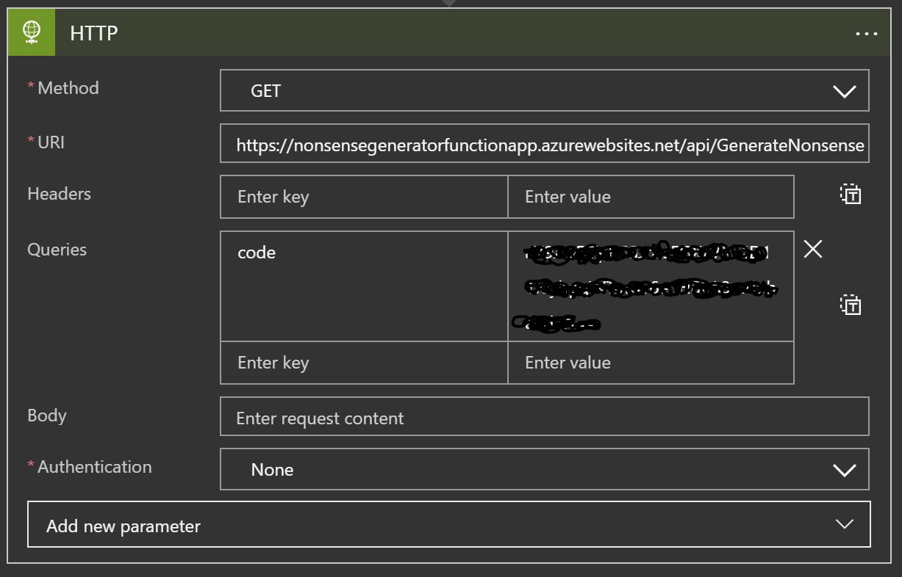

First up 'Method'. We should set this to GET. GET is the most straight forward of HTTP calls. You _get_ whatever is behind the URL you give. Remember when we built the function we set the _body_ to be a piece of text? Well, that is what we are _getting_ in this case.

The URL is the URL of the Function we created. Don't ask me why the Functions App says 'Get Function URL' and Logic Apps says 'URI'. For our purposes, right now, they are the same thing.

Now, you will remember we talked about 'code' being included in the Function URL as the method of Authentication. You need to take that off the Function URL and add it to the 'Queries' section.

`https://nonsensegeneratorfunctionapp.azurewebsites.net/api/GenerateNonsense` my Function URL becomes this. (Note there is no ? or & or anything following 'GenerateNonsense').

I then take the section after the ? `code=aCollectionOfLettersAndNumbers==` and remove `code=` to leave me with the code itself `aCollectionOfLettersAndNumbers==`. I need to keep the `==` on the end as that is part of the code. Then, as in the screen grab, I put 'code' as the query left hand key box and the code (the things with == on the end) in to the right hand value box.

Leave the Body and Authentication box as they are.

Use the '...' menu to Rename it something useful (you will be glad you did later).

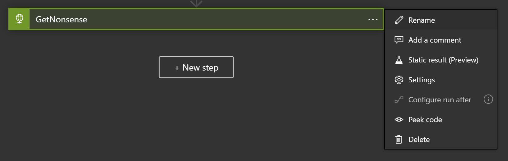

## Sending to the Twitters

Add a step and search for 'Twitter'

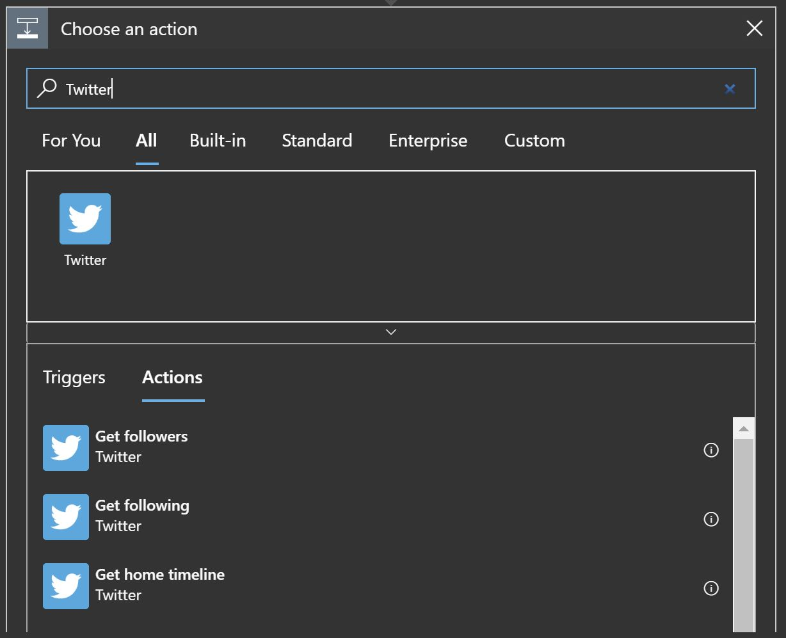

Choose the 'Post a tweet' action.

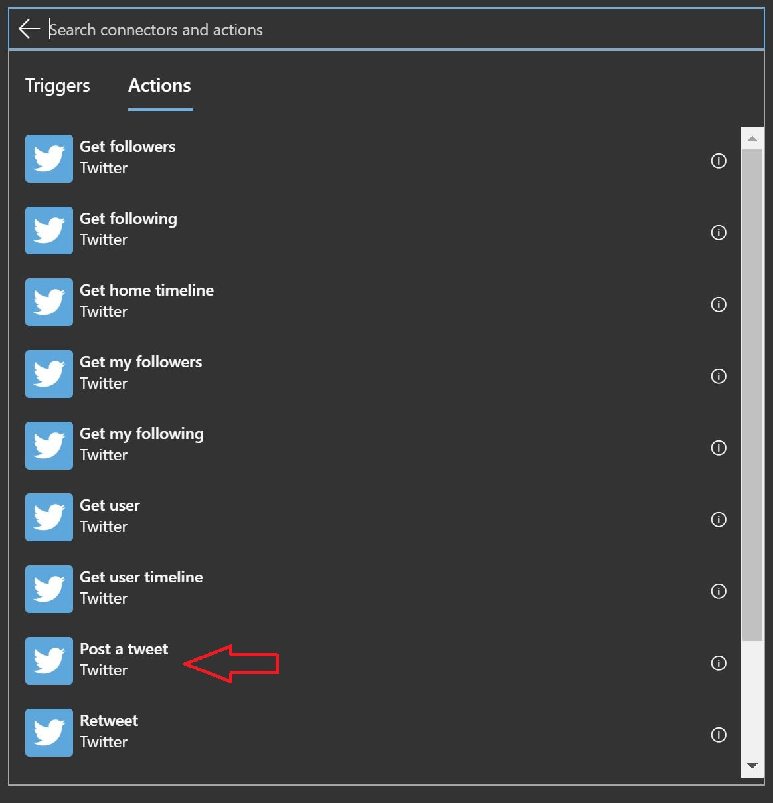

You will then be prompted to 'Sign in', do that

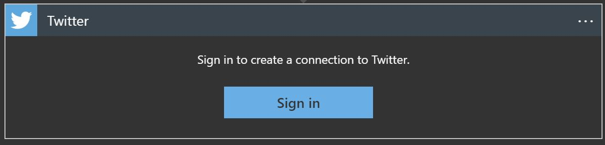

This brings up a separate browser window (depending on many things, this might appear behind your current browser window, keep an eye out for that).

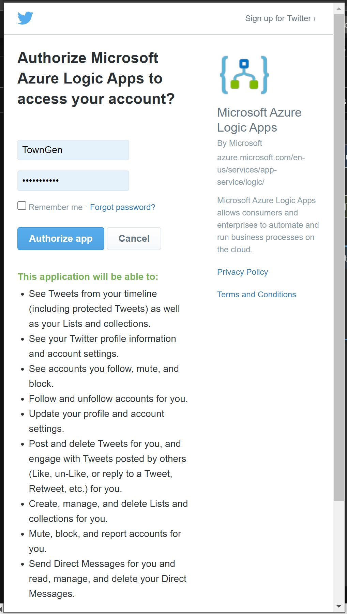

What you will notice here is that you are authorising 'Microsoft Azure Logic Apps' to access the Twitter account - not a custom app that belongs to the Twitter account. At the bottom you will see all the authorisations you are making. These relate to all the things Logic Apps can automate for you. Authorising Logic Apps is far easier than building and authorising your own app to access the Twitter API for you.

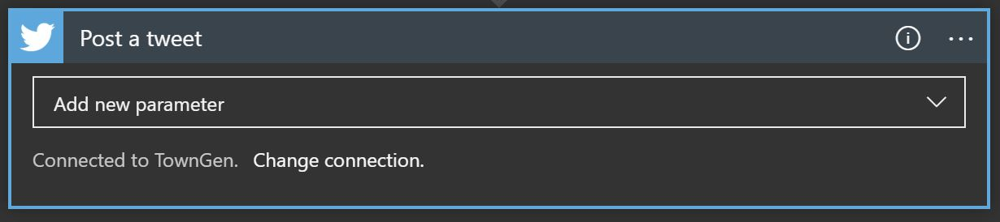

When you have successfully authorised, your 'Post a tweet' action will look like this. Notice that at the bottom it tells you which connection is being used.

Click on 'Add new parameter' and choose 'Tweet text'. You could just type a message here, but we are going to use the text our Function generates.

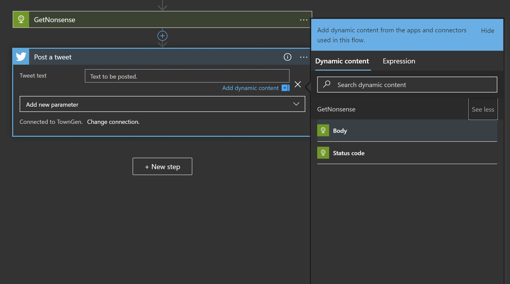

Add dynamic content and select the 'body' of your HTTP action. Remember how we gave it a sensible name above? Well that is now the name you are looking for. Click 'show more' next to it and choose 'Body'. Remember how the _body_ is what we set in the Function code, and now we _get_ that _body_ in the HTTP action and pass it to the text of the Tweet.

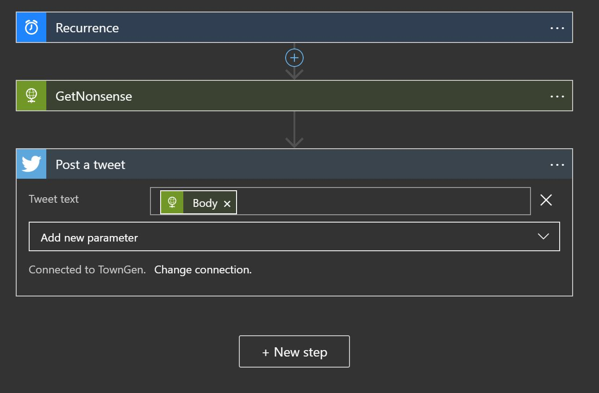

We are now ready to Tweet!

## Lets make a Tweet!

In the top bar, click Save and then Run

Go back to the Overview panel of the Logic App and look at the bottom at Runs history. Click on your latest run (There should only be one, and it should say 'Succeeded').

When you click you should see this in the loaded panel

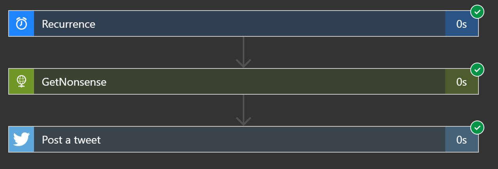

If you now go to your connected Twitter account you should see the Tweet.

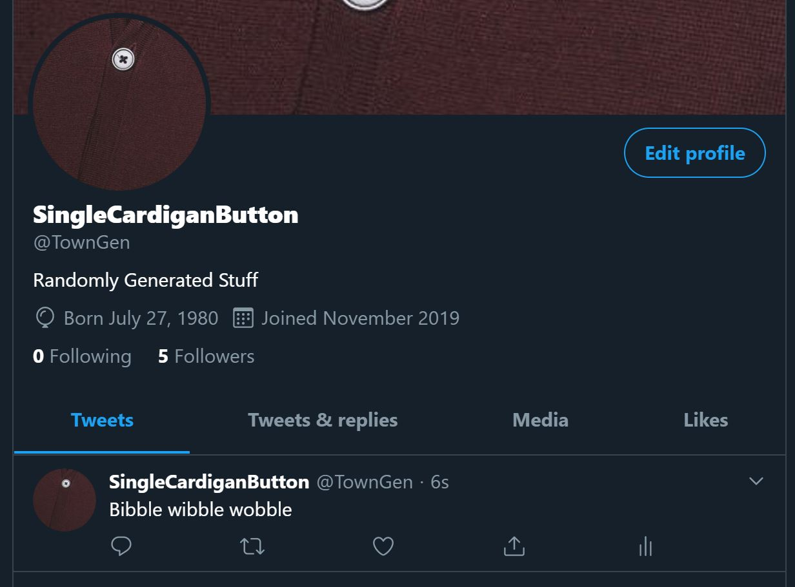

## OH NO!

If you run the Logic App again, this will happen.

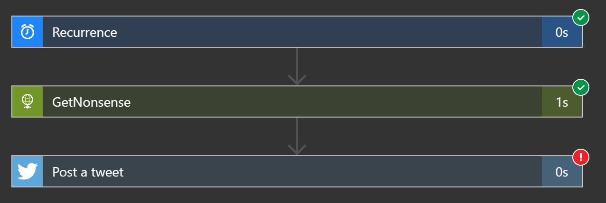

If you click on the 'Post a tweet' action you will see what the error is.

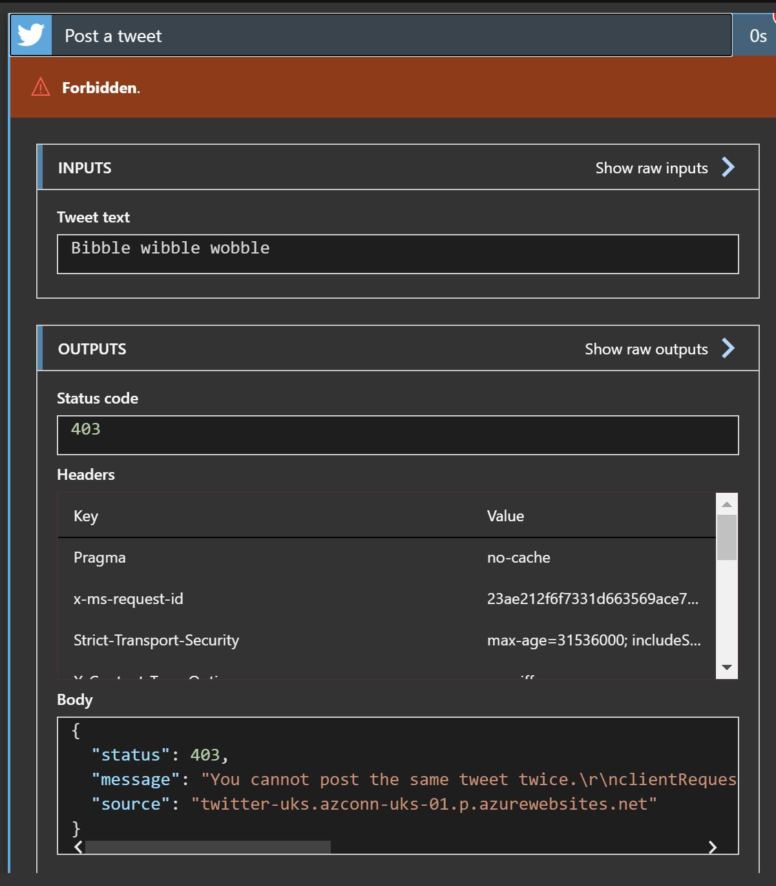

Twitter doesn't allow you to post the same tweet twice. The message about the error comes back in the Body field of the Outputs box.

Why has this happened?
It is because our Function only returns one thing. We will have to go and change that. But first go back to the overview panel for the Logic App anc click 'Disable'.

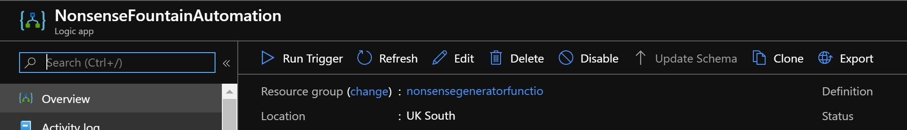

This means that the Recurrence trigger won't run every hour. We can enable this again when we have fixed our problem.

We have made a small code change before. When we did this we had to check the code in and then deploy to Azure manually. This is problematic for several reasons:

1. It's extra work. We want to focus on the important and interesting pieces of our code, not doing repetitive and boring steps.

2. It makes is hard to work as a team. As we all know _Teamwork makes the dream work_. We want to enable multiple developers to collaborate through source control on the code of our Functions.

3. DevOps is cool, we want some of that. We don't have it right now. We want, what is known as, CI/CD (Continuous Integration/Continuous Deployment). This is where any code change is integrated into the overall system and deployed as quickly as possible with automation.

Lets learn how in [Step 6](STEP6.md).
