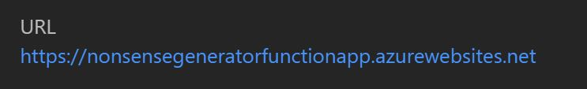
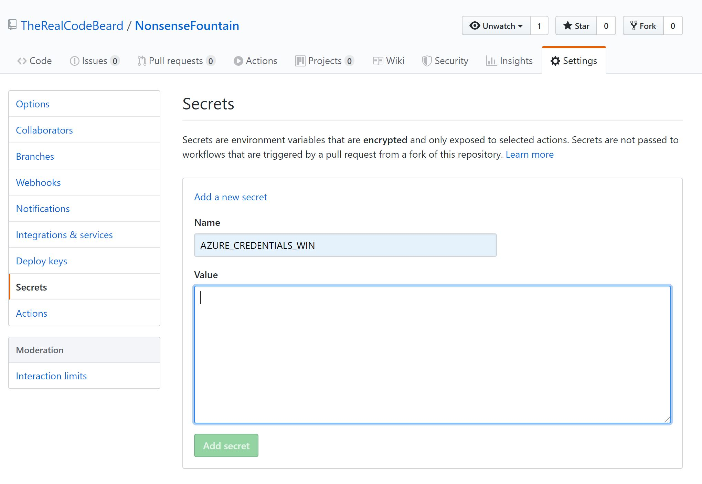
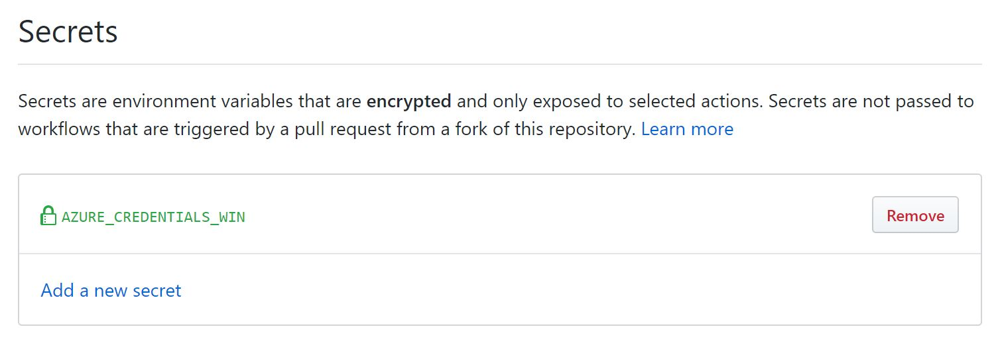
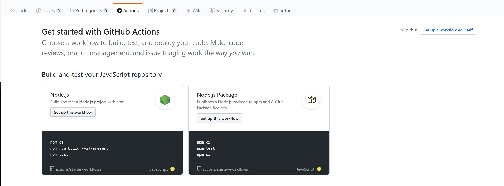
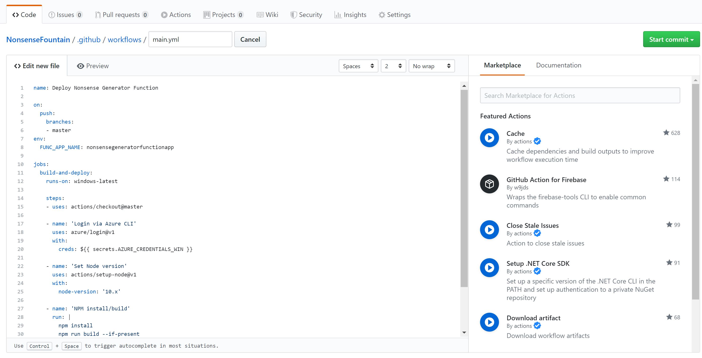
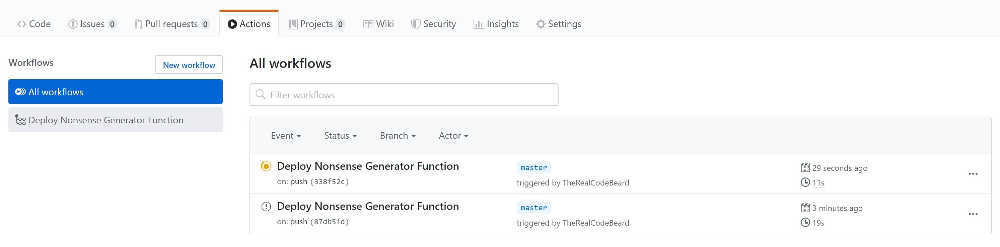
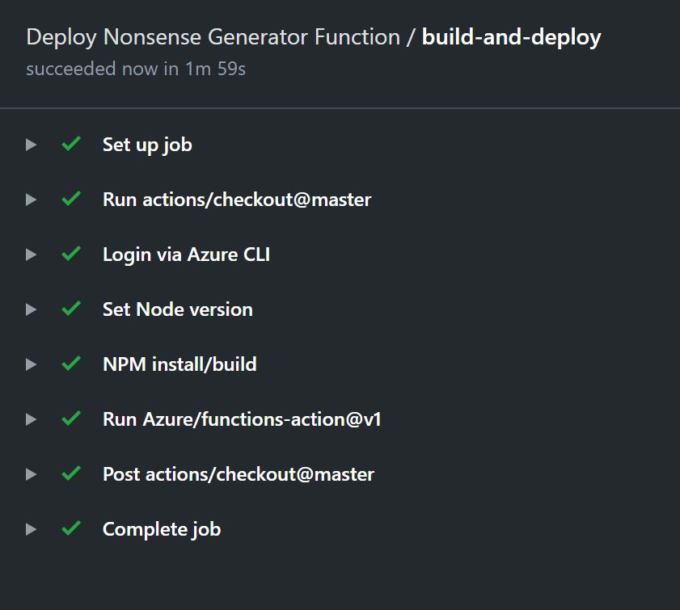
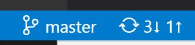
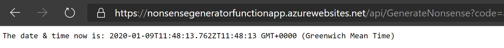

# Step 6: Set up a GitHub Action

## What's this all about?

GitHub Actions is a great [CI/CD](https://en.wikipedia.org/wiki/CI/CD) framework that uses simple [YAML](https://en.wikipedia.org/wiki/YAML) files to automate the your workflow. It is like Logic Apps for CI/CD ... but it uses YAML instead of a graphical user interface.

There is huge depth to [GitHub Actions](https://github.com/features/actions) and you can read more there should you choose. We are going to do the absolute minimum to get our Node.js Function automatically deployed to Azure when we push the code to our GitHub repository. We will remain focused on the Function and we will not be automatically deploying the Logic App.

## TL;DR

- Generate a service principal for GitHub actions from Azure Cloud Shell.
- Set up a GitHub action on the repo using the secret.
- Test the GitHub action runs correctly.
- Make a code change to create _unique_ tweets and check in.

## Known gotchas

1. To be able to deploy to Azure from GitHub actions in this way you will need to be able to set up a [Service Principal](https://docs.microsoft.com/en-us/azure/active-directory/develop/app-objects-and-service-principals) in your Azure subscription relating to your Functions App. Make sure that you have the ability to do this.

2. We will be setting up a Service Principal using the Cloud Shell capability within Azure. We will be copying from that command line security keys and details to paste into GitHub. If you choose to copy these into an intermediate location (notepad, VSCode for example) be careful not to save this or release it into the public repository. This would represent a security attack vector!

## Create your Service Principal Secret

The first thing we need to do is to create the Service Principal as relates to our Function App. We need to paste this into GitHub so we can refer to it later.

In Azure click the Cloud Shell button in the top bar of the portal (next to the Search box right at the top of the window.


Click this button and Cloud Shell will load at the bottom of the portal window. When this has finished you will end up with a cursor on a command line. 

> Note. If this is the first time using the Azure Cloud Shell you will be prompted to create or select a storage account to use, if any any doubt simply take the defaults. Should you want more options, Azure docs has [more information on this subject](https://docs.microsoft.com/en-us/azure/cloud-shell/persisting-shell-storage)

There are detailed instructions on the [GitHub page relating to Service Principals](https://github.com/Azure/functions-action#using-azure-service-principle-for-rbac-as-deployment-credential). That you can read up on further should you wish to.

The template for the command you will be using is as follows

```bash
az ad sp create-for-rbac --name "myApp" --role contributor \
    --scopes /subscriptions/{subscription-id}/resourceGroups/{resource-group}/providers/Microsoft.Web/sites/{app-name} \
    --sdk-auth
```

This is a 'one line' command. But for ease it has been split over several lines with the \ character. What is going on in this command and what do you have to fill in?

`az` is the Azure Command Line administrative application (aka 'the Azure CLI'). 

`ad` is the Active Directory command. Active Directory is the identity provider for Azure.

`sp` means Service Principal. This is the thing that we are creating.

`create-for-rbac` lets the tool know we are creating the service principal for 'role based access control' (rbac).

Anything with '--' in front of it is a setting for the command.

`--name` What are you going to call this service principal? Fill in a sensible name between the "".

`--role contributor` This is the _role_ (see: rbac) that the service principal needs to be able to release the Function App on your behalf. This is the _role_ you are giving the GitHub action by providing it with this secret.

`--scopes` This setting gives the service specific access to a resource in azure. You will see here that there are sections between curly braces '{}'. These are the places you need to fill in the details of your app.

In each case you need to replace the whole section including the '{}'.

`{subscription-id}` this is available from the Overview panel of your resource group.

`{resource-group}` this is the _name_ of your resource group. In my case this was the truncated, lowercase name of my app. 'nonsensegeneratorfunctio'

`{app-name}` this is the _name_ of your Function App. The easiest way to find this is on the Overview panel of the Function App in the URL.



The app name is the sub domain of this URL. The sub domain is the section between the `//` and the `.azurewebsites` part. In this case `nonsensegeneratorfunctionapp`. You will notice this is the name you gave for the Function App in lowercase and URL safe.

`--sdk-auth` means output the result in a format that is compatible with Azure SDKs, in essence you get a chunk of JSON as the output.

When you have filled in all those details (you may want to build the command up in Notepad or VSCode) you will need to copy this and paste it into the cloud shell. Pasting in the command should run it automatically. If it doesn't, hit return to execute. 

You will end up with a block of JSON that looks like this, with the `<GUID>` sections filled in.

```json
  {
    "clientId": "<GUID>",
    "clientSecret": "<GUID>",
    "subscriptionId": "<GUID>",
    "tenantId": "<GUID>",
    (...)
  }
```

The `(...)` section represents some extra lines that provide various URLs and Endpoints. The JSON object itself is about 12 lines long including '{}'.

Copy the whole JSON object.

> Optional. For those of you who are a little more comfortable with the command line and bash, then you could make use of [JMESPATH](https://azurecitadel.com/prereqs/cli/cli-3-jmespath/) queries. This will save you manually building the id of the Function App in your command:
>
> ```bash
> funcname="Change_To_Your_Function_App_Name"
> funcid=$(az functionapp list --query "[?name == '"$funcname"'].id" --output tsv)
> az ad sp create-for-rbac --name "http://$funcname" --role Contributor --scopes $funcid --sdk-auth
> ```

**NOTE** In the above the Function App Name is case sensitive. 

## Putting the Secret in GitHub

In your GitHub repository go to the 'Settings' tab and 'Secrets' section.



Name your Secret `AZURE_CREDENTIALS_WIN` (you can name it anything, but this is the name we use later so keeping it the same is less work for you). Then paste your JSON object (including the clientSecret) into the 'Value' box and click 'Add secret'.

When you have done this, the secret is locked and you can only 'Remove' it. It's encrypted and no one can see it. Only Actions can use it. Very safe.



This was the most complicated bit of our whole process. If you have made it this far ... it's all plain sailing from here on in.

## Adding the GitHub Action

Breathe in deeply and let it out slowly. We are almost at the end and what you are about to have available is a great Serverless platform to build all kinds of fun things!

Click on the Actions tab in your GitHub repository.



GitHub helpfully presents a collection of standard workflow templates for you to use. For today we are going to skip this and click 'Set up a workflow yourself' in the top right. The awesome [Ben](https://github.com/benc-uk) has kindly provided a template for us to use. The GitHub actions platform is so rich that taking you through every part would just take too long. So I am short cutting it to the one template for this tutorial.

## The workflow YAML file

You can find the workflow.yml file in this repo. [workflow.yml](workflow.yml). There are a few pieces of this you will need to update to relate to your functions app.

After clicking the 'Set up a workflow yourself' button, GitHub will be showing a 'Edit new file' editor. Copy and paste the entire `workflow.yml` file into the editor replacing everything currently there.

You will see that in the path section we are in the `.github/workflows` folder editing a file called `main.yml`. GitHub has helpfully put the file in the right place for us!



Before you commit this file and, basically, make your action live, you will need to make the following changes:

`name:` at the top. Give your workflow a sensible name.

The next part can be read as a sentence 'on push branches master'. This is when your action will trigger.

`FUNC_APP_NAME:` you need to set this to be your Function App Name. This is the same as we used in the Service Principal. The URL safe version of the name of the Function App we created.

The jobs section is all related to what we want the workflow to do. It's very human readable and means what it says.

'runs on windows latest' for example.

'steps' are the tasks the workflow will carry out.

- Check out master branch
- Log in to Azure. Notice here how `creds` is set to `${{ secrets.AZURE_CREDENTIALS_WIN }}`. This is how, in an Actions YAML file you refer to the secret created earlier. If you changed the secret name, you will need to update that here.
- Set Node version. Remember how we chose Node 10.x when we set up the Function App originally? Well, this version must match!
- NPM Install and build. This contains a set of commands for the Node Package Manager (NPM) to make sure all of our dependencies are used. In our simple case we don't have any dependencies ... so that is OK then.
- The last step the `FUNC_APP_NAME` we set above to tell the Action which function app we are deploying too.

So as long as you have set up your Function App Name and Secret correctly, that is all you need to do.

Click the 'Start commit' button and fill in your commit message and push. (Yes, in the GitHub portal).

Because you just pushed a commit, the Action will run. You will need to click on the 'Actions' tab in GitHub in order to see it running.



Wait and see what happens, it should succeed. If you click on the workflow name, you should see the steps that were laid out in the YAML file we just created.



## Code change 2

Before we check in we need to make sure that the tweet is 'unique'. I am going to do that in the most boring way possible for now. In the `index.js` file change the function to output the date and time.

```javascript
module.exports = async function (context, req) {
    context.log('Generating Nonsense...');
    let now = new Date();
    context.res = {
        body: "The date & time now is: " + now.toISOString() + "T" + now.toTimeString()
    };
};
```

Just what everyone wants. A twitter bot that tells you the time every hour. This is guaranteed to be unique because it tweets every hour and includes the date.

_Commit that change_ and then sync the repository with GitHub.



Go to GitHub and watch the workflow trigger, run & complete.  

Then check your function output via the URL as we did before.



You should see that it now shows the date and time.

When you are ready, move on to [Step 7](STEP7.md) to reactivate the Logic App!