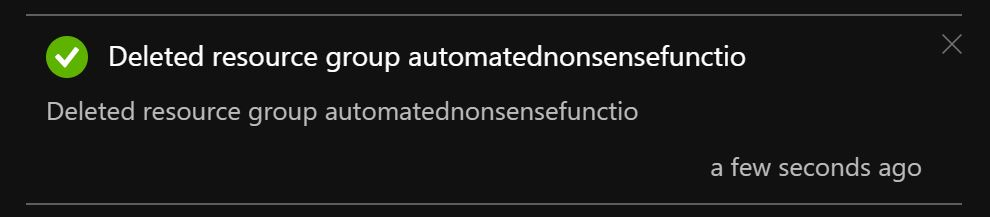

# Teardown

## What's this all about?

This covers how to remove the things you have done from Azure.

It won't cover deleting the Twitter account or the GitHub repo. 

## TL;DR

- Delete the resource group and all the resources in it.

## Known gotchas

1. Don't delete the wrong things.
2. If you delete the Azure components the GitHub Action will fail.

## Deleting the resource group in Azure

Navigate to the Resource Group in the Azure portal.

Click on the 'Delete Resource Group' button in the top bar.

A panel will pop open to the side of our screen. This will list all the resources in your resource group. You will be asked if you are sure and you will have to type (the possibly truncated) name of the resource group to be able to continue.

Please note, I added this step after deleting the resource group from the original screen grabs. This is why the name is slightly different. :)

Click 'Delete' at the bottom of this panel when you are sure. 

## Deleting the resource group in Azure

That's it!

The resource group and all the resources in it will be deleted.

